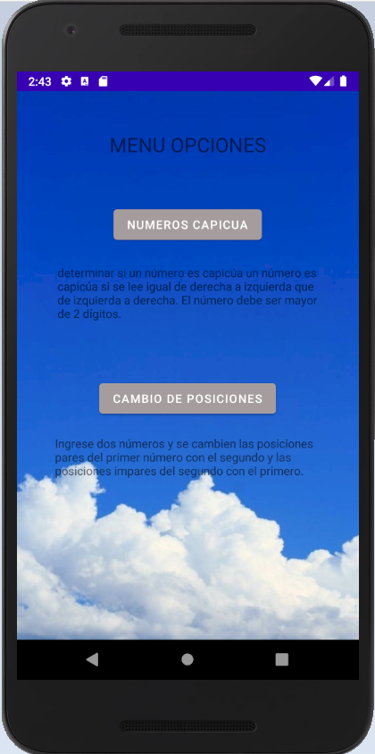
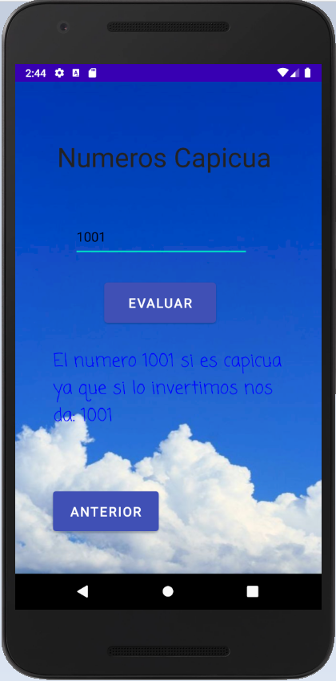
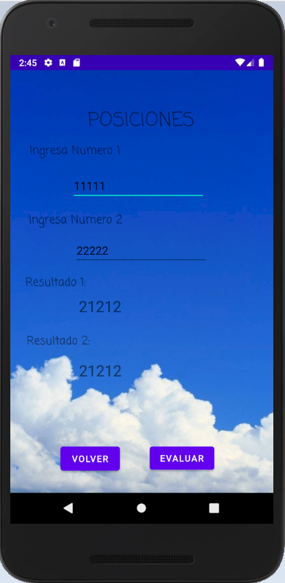

# Palindromic-numbers

Caracteristicas de la aplicacion: 

1.   Desarrollar una aplicación que determine si un número es capicúa un número es capicúa si se lee igual de derecha a izquierda que de izquierda a derecha. 
El número debe ser mayor de 2 dígitos.
 

2.   Desarrollar una aplicación que ingrese dos números y se cambien las posiciones pares del primer número con el segundo y las posiciones 
impares del segundo con el primero.

Demostracion de la aplicacion: 

1.Animacion de inicio

2.Menu principal

3.Numeros Capicua

4.Invetir posiciones de numeros:

